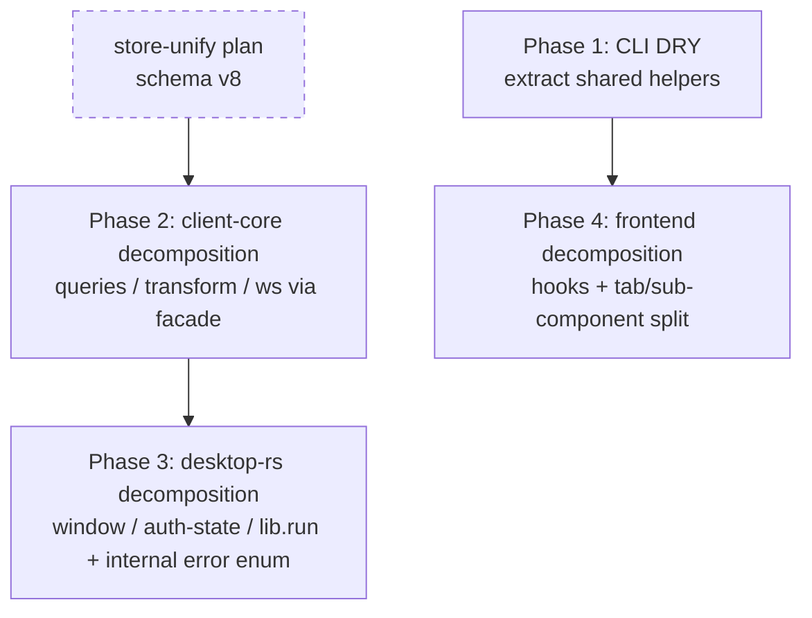

# Monorepo Refactor — Audit & Phased Plan

## Context

The cinch monorepo (one Cargo workspace + Tauri frontend) has accreted a set of
god-files and duplicated helpers as features landed. This plan is a **behavior-preserving**
refactor: no functional, UX, CLI-output, or wire changes. External behavior stays
byte-identical; only internal structure improves. Four objectives in priority order:
(1) decompose god-files, (2) eliminate duplication, (3) clarify module boundaries,
(4) tighten type-safety & error consistency.

The work lands in an **agent worktree** (`./scripts/new-agent-worktree.sh refactor monorepo`),
never in `main/`. Every phase boundary must keep `make build`, `make test`, `make lint`
green and is committed atomically.

### Audit findings (verified line counts, 2026-06)

| Area | File | Lines | Smell |
|---|---|---|---|
| client-core | `store/queries.rs` | 1220 (~500 code / ~720 tests) | god-file: clips CRUD + search/FTS + devices + retention + sync-state all in one |
| client-core | `ws.rs` | 816 (~half tests) | god-file: types + run/connect loop + decode + decrypt |
| client-core | `transform.rs` | 678 | god-file: pure transforms (json/redact/encoding/markdown) |
| CLI | `commands/list.rs` / `pull.rs` / `push.rs` | 768/697/392 | duplication: `resolve_source`, `decrypt_clip*`, `content_type`, `format_bytes`, time-fmt copy-pasted |
| CLI | ~15 command files | — | duplication: `load_config().map_err(...)` boilerplate repeated |
| desktop-rs | `commands/window.rs` | 579 | god-file: geometry + snap overlay + copy-toast + drag |
| desktop-rs | `auth/state.rs` | 562 (~330 tests) | god-file: state machine + pending-codes + backoff |
| desktop-rs | `lib.rs` `run()` | 556 | god-function: ~180-line state-construction + `.manage` wiring block |
| desktop-rs | 35+ commands | — | weak typing: `Result<_, String>` everywhere; client-core uses `thiserror` enums |
| frontend | `DevicesPanel.tsx` | 1431 | god-component: 12 useState + data fetch + nickname edit + alerts + colors + SSH dialog |
| frontend | `App.tsx` | 1181 | god-component: ~20 useState + theme + refresh fns + event subscriptions |
| frontend | `SettingsPane.tsx` | 1154 | god-component: 5 tabs inline + duplicated shortcut-editor logic |
| frontend | `SearchBar.tsx` | 625 | god-component: filter dropdown + device dropdown + theme menu |
| frontend | `App.tsx` ↔ `DevicesPanel.tsx` | — | duplication: `tagColors`/`displayNames` localStorage state in both |

**Already healthy (do not touch as "type-safety" work):** TS is `strict: true` with
**zero** `any` (verified). `invoke<T>`/`listen<T>` direct usage is already zero per
desktop CLAUDE.md. client-core already uses `thiserror` enums consistently. The only real
type-safety gap is the desktop Rust `Result<_, String>` commands (objective 4 below).

**Decisions (confirmed):** Execute **all four phases** sequentially, pausing for review at
each phase boundary. This refactor runs **before** the store-unify plan
(`plans/2026-06-01-unify-desktop-cli-store.md`). Therefore Phase 2's `queries.rs`
decomposition is kept **minimal and facade-only** (re-export, no SQL/signature changes) so
the later store-unify edits (schema v8 settings table + new accessors) rebase cleanly onto
the split modules.

## Phase dependency / shape

Phases are independently shippable & verifiable. Order = lowest-risk/highest-leverage
first. P1 and P2 are independent of each other; P3 builds on P2's client-core shape only
loosely (no hard dependency); P4 is independent but cheap to do last.

---

## Phase 1 — CLI: eliminate duplication, extract shared helpers

**Scope / files touched:** `crates/cli/src/commands/list.rs`, `pull.rs`, `push.rs`;
new `crates/cli/src/commands/shared.rs` (or extend existing `crates/cli/src/io.rs` /
`exit.rs` helpers); ~15 command files for the config-load helper.

**Concrete moves:**
1. Create `crates/cli/src/commands/shared.rs` and move the copy-pasted helpers there as a
   single canonical impl each, deleting the duplicates:
   - `format_bytes` (currently in both `pull.rs:567` and `push.rs:208`).
   - `content_type(&str) -> Option<ContentType>` (`pull.rs:516`).
   - `resolve_source` — reconcile the two variants (`list.rs:484` takes
     `&[DeviceInfo]`, `pull.rs:460` takes `&RestClient`); keep both signatures only if
     they genuinely differ, otherwise unify on the `&[DeviceInfo]` form.
   - clip decryption: `list.rs:521 decrypt_clip_in_place` and `pull.rs:476 decrypt_clip`
     are the same operation with different ownership. Provide one
     `decrypt_clip_in_place(cfg, &mut Clip)` and have `pull` wrap it.
   - `into_wire_clip` (`list.rs:427`) and `write_image` (`pull.rs:526`) — move if used by
     >1 module; otherwise leave local.
2. Add a config-load convenience that maps to `ExitError` once, killing the repeated
   `load_config().map_err(|e| ExitError::new(...))` boilerplate (~15 sites). Put it next
   to `auth_state.rs`/`exit.rs` (e.g. `pub fn load_config_or_exit() -> Result<Config, ExitError>`),
   reusing the existing `From<HttpError> for ExitError` style in `exit.rs:52`.

**Behavior preservation:** `list.rs` and `pull.rs` already have rich `#[cfg(test)] mod
tests` covering `resolve_source`, `content_type`, `format_bytes`, render/decrypt. Move the
tests alongside the moved fns (or keep them green by re-export). Add a characterization
test asserting `format_bytes` parity across the old buckets before deleting the second
copy. Verify with `cargo test -p cinch`.

**Risk:** Low — pure helper consolidation, all well-tested. **Rollback:** revert the commit;
helpers are additive then call-sites switch over.

**NOT in this phase:** no changes to command behavior, output format, or argument parsing;
no move of helpers down into `client-core` (CLI-presentation logic stays in CLI).

---

## Phase 2 — client-core: decompose `queries.rs`, `transform.rs`, `ws.rs`

**Scope / files touched:** `crates/client-core/src/store/queries.rs` (+ new sibling
modules), `crates/client-core/src/store/mod.rs`, `transform.rs` → `transform/`, `ws.rs` →
`ws/`. **35 importers of `store::queries`, 11 of `ws`, 3 of `transform`** — use the
**facade pattern** to keep blast radius at zero.

**Concrete moves (facade approach — no call-site churn):**
1. **`store/queries.rs` → focused modules**, then make `queries` a re-export facade.
   New private-impl modules under `store/`:
   - `clips.rs` — `insert_clip`, `list_clips`, `get_clip`, `delete_clip`, `set_pinned`,
     `clip_count`, `clear_all_clips`, `purge_clips_before`, `count_clips_before`.
   - `search.rs` — `ParsedQuery`, `parse_query_string`, `query_clips`, `search_clips`,
     `sanitize_fts_query`.
   - `devices.rs` — `list_devices`, `list_sources`.
   - `retention.rs` (store-side) — `set_retention`, `list_retention`.
   - `sync_state.rs` — `watermark`, `set_watermark`, `list_pending_clips`, `mark_pending`,
     `mark_local`, `enforce_offline_cap`, `replace_id_and_mark_synced`.
   - Move each fn's tests into the corresponding new module.
   - In `store/mod.rs` add `pub mod clips; pub mod search; ...`. Replace `queries.rs` body
     with `pub use crate::store::{clips::*, search::*, devices::*, retention::*, sync_state::*};`
     so `client_core::store::queries::insert_clip` still resolves. (Optionally migrate
     call-sites later; not required for behavior preservation.)
2. **`transform.rs` → `transform/` module** (all pure, fully unit-tested):
   - `mod.rs` — `TransformAction`, `TransformActionInfo`, `TransformError`,
     `list_transform_actions`, `apply_transform`, `is_text_like` (dispatch surface).
   - `json.rs` — `pretty_json`/`minify_json`/`validate_json`/`format_json_*`/json helpers.
   - `redact.rs` — `redact_secrets` + all `redact_*`/`is_secret_key`/`normalize_secret_key`.
   - `encoding.rs` — `percent_encode`/`percent_decode`/`hex_value`.
   - `markdown.rs` — `markdown_code_block`/`markdown_backtick_fence`/`markdown_language_hint`
     + whitespace/`shell_single_quote` helpers.
3. **`ws.rs` → `ws/` module:**
   - `mod.rs` — `WsEvent`/`WsStatus`/`WsError`/`WsConfig`/`DecryptOutcome` types + `run`/
     `fetch_ws_ticket`/`connect_and_listen`.
   - `decode.rs` — `DecodeOutcome`, `decode_message`, `finalize_new_clip`, `needs_media_fetch`.
   - `decrypt.rs` — `decrypt_clip_content`, `decode_and_finalize`.
   - Split the test module to match; keep `pub(crate)`/`pub` visibility identical.

**Behavior preservation:** These are mechanical moves of already-unit-tested code. The
facade keeps every external path identical. Run `cargo test -p cinchcli-core` after each
file split (commit per file). The `testdata/wire-vectors.json` gate and `content_type`
vocabulary are untouched (no `.proto`, no serialization logic changes).

**Risk:** Low-medium. This refactor lands *before* store-unify, so the hazard is the
reverse: store-unify will later add schema v8 + settings accessors onto the split modules.
**Mitigation:** keep the `queries.rs` split facade-only (no SQL/signature changes) so those
later edits drop into `clips.rs`/`search.rs`/etc. without conflict; leave a short header
comment in each new module noting the facade. **Rollback:** per-file revert; facade
isolates consumers.

**NOT in this phase:** no signature changes, no error-type changes, no query/SQL
behavior changes, no call-site migration away from the `queries` facade.

---

## Phase 3 — desktop Rust: decompose god-files + consistent internal errors

**Scope / files touched:** `apps/desktop/src-tauri/src/commands/window.rs`,
`auth/state.rs`, `lib.rs`, and a new internal error type. (`clipboard/monitor.rs` is
borderline — see out-of-scope.)

**Concrete moves:**
1. **`commands/window.rs` → `commands/window/` module:**
   - `geometry.rs` — `to_box`, `win_size`, `current_monitor`, `cursor_monitor`,
     `copy_toast_metrics`, `reference_copy_toast_metrics`, `MonitorBox`.
   - `overlay.rs` — `ensure_overlay`, `place_overlay`, `emit_guide`, `within_snap`,
     `SnapState`.
   - `copy_toast.rs` — `CopyToastState`, `ensure_copy_toast`, `place_copy_toast`,
     `show_copy_toast` (the `#[tauri::command]`).
   - `drag.rs` — `snap_drag_start`, `on_window_moved`, `finish_drag`, `left_mouse_down`,
     `save_placement`/`load_placement`.
   - Keep `#[tauri::command]`/`#[specta::specta]` attributes on the exact same fns so
     `bindings.ts` is unchanged. Re-export from `commands/window/mod.rs` so the
     `generate_handler!` list in `lib.rs` keeps the same paths.
2. **`auth/state.rs` → split:**
   - `auth/state.rs` keeps `AuthState`/`AuthEvent`/`transition`/`classify_next_state`
     (the state machine — the file's namesake).
   - `auth/pending_codes.rs` — `PendingDeviceCode`, `add/remove/pending_count/
     pending_codes/sweep_expired`.
   - `auth/backoff.rs` — `Backoff`.
   - Move each group's tests with it.
3. **`lib.rs` `run()` slimming:** extract the ~180-line state-construction + `.manage`
   block into `setup.rs` helpers (e.g. `fn build_managed_state(...) -> ManagedHandles` and
   `fn manage_all(builder, handles)`), leaving `run()` as readable orchestration. Keep the
   `make_specta_builder()` / `invoke_handler` / `.setup()` wiring exactly as-is. **This is
   the riskiest move** — do it last, in its own commit, behind full `pnpm tauri` build.
4. **Internal error consistency (type-safety, objective 4) — conservative:** introduce a
   `CommandError` enum (in a new `commands/error.rs`) with `thiserror`, mirroring
   client-core's pattern, and `impl From<CommandError> for String` (or a `to_command_string`).
   Command bodies use `?` on `CommandError` internally; **at the command boundary the
   return type stays `Result<_, String>`** so `bindings.ts` and the frontend's error
   handling are byte-identical. This unifies internal propagation without a wire change.
   Migrate a representative cluster (e.g. `commands/clips/*`, `commands/relays.rs`) as the
   pattern; full migration can continue incrementally.

**Behavior preservation:** Regenerate bindings (`make generate` /
`cargo test -p cinch-desktop export_bindings -- --ignored`) and assert `bindings.ts` diff
is **empty** — that is the proof the command surface is unchanged. Run `cargo test
-p cinch-desktop` + `pnpm test`. `auth/state.rs` and `window.rs` carry strong existing
test suites (D15 state-machine tests, geometry/placement tests) — move them, keep green.

**Risk:** Medium (Tauri command registration + `lib.rs` orchestration). **Rollback:**
per-file revert; the empty-`bindings.ts`-diff check catches any accidental surface change
before commit.

**NOT in this phase:** NO change to command return types on the wire (no `String` →
enum at the boundary), no new/removed commands, no event changes, no `clipboard/backend/
macos.rs` (platform code, lower leverage). `clipboard/monitor.rs` (553, ~180 code) is
borderline — defer unless time allows.

---

## Phase 4 — frontend: extract shared hooks, split god-components

**Scope / files touched:** `App.tsx`, `components/DevicesPanel.tsx`, `SettingsPane.tsx`,
`components/SearchBar.tsx`; new files under `apps/desktop/src/lib/state/` and
`apps/desktop/src/components/`.

**Concrete moves:**
1. **Kill the App↔DevicesPanel duplication first** (highest leverage): both hold
   `tagColors`/`displayNames` in `useState(() => loadMachineTagColors())` /
   `loadMachineDisplayNames()`. Extract a `useMachineLabels()` hook into
   `lib/state/machineLabels.ts` (co-locate with the existing `lib/machineTagColors.ts` /
   `lib/machineDisplayNames.ts` loaders). Both components consume the hook.
2. **`App.tsx`:** extract data + subscription hooks into `lib/state/`:
   - `useClips()` (wraps `refreshClips`, pinned/inbox recency, `listClips` calls).
   - `useSources()`, `useDevices()`.
   - `useClipEvents(handlers)` — the big `events.*.listen(...)` effect block (`App.tsx:295+`).
   - Move the local `useTheme`/`systemPreference`/`resolveMode` into `lib/state/theme.ts`.
   App becomes composition of hooks + JSX.
3. **`DevicesPanel.tsx`:** extract `useDevicesData()` (fetchAll, alertSettings, revoke,
   toggleAlert, nickname edit state machine) into a hook; split the already-separate
   `AlertToggle` and `DeviceSettingsPanel` sub-components into their own files under
   `components/devices/`.
4. **`SettingsPane.tsx`:** split the 5 inline tabs (`general|account|shortcuts|servers|
   sessions`) into `components/settings/{General,Account,Shortcuts,Servers,Sessions}Tab.tsx`.
   Extract the duplicated shortcut-editor logic (`currentShortcut`+`sendShortcut` parallel
   state, `SettingsPane.tsx:137-146`) into a `useShortcutEditor()` hook.
5. **`SearchBar.tsx`:** extract the filter-dropdown and device-dropdown into sub-components
   (`FilterDropdown`, `DeviceDropdown`) and lift their keyboard-nav state into a small
   `useDropdownNav()` hook; theme menu likewise.

**Type safety:** all new hooks/components fully typed (no `any` — already the invariant);
reuse existing typed `LocalClip`/`Device`/`SourceInfo` from `bindings` and existing
`lib/clipFilters.ts`, `lib/sourceColor.ts`, `lib/deviceOptions.ts`.

**Behavior preservation:** strong existing suites — `App.test.tsx`, `DevicesPanel.test.tsx`,
`SettingsPane.test.tsx`, `SearchBar.test.tsx` (494 lines). Keep them green; extracting to
hooks should require near-zero test edits (tests drive the rendered component). Run
`pnpm test` + `pnpm exec tsc --noEmit` after each component.

**Risk:** Low-medium (UI regressions). **Rollback:** per-component revert; tests gate each.

**NOT in this phase:** no visual/UX/style changes, no new props/behavior, no state-management
library introduction (plain hooks only), no routing changes.

---

## Cross-phase guarantees (run at EVERY phase boundary)

- `make build`, `make test`, `make lint` all green; report status and **pause for review**
  after each phase.
- Never hand-edit generated code (prost OUT_DIR, `go/cinch/v1/*.pb.go`, `src/bindings.ts`).
  Phase 3's proof of correctness is an **empty `bindings.ts` diff** after regeneration.
- Wire compat: `testdata/wire-vectors.json` byte-equality gate stays green; `content_type`
  stays the canonical 4 strings. No `.proto` edits in this refactor.
- `client-core` stays `publish = false`, path-deps only; single version, **no version bump**.
- Commit atomically per logical move: `refactor(<scope>): <what>`; many small reviewable
  commits over one large one. Add characterization tests BEFORE risky moves.

## Verification (end-to-end, per phase)

1. `make test` (cargo workspace + pnpm + go) and `make lint` green.
2. Phase 2/3: `make generate` then `git diff --exit-code apps/desktop/src/bindings.ts
   go/cinch/v1/` must be clean (no generated drift).
3. Phase 3: `pnpm tauri build` (or `make dev-desktop` smoke) to confirm command/event
   registration intact.
4. Phase 4: `pnpm exec tsc --noEmit` + `pnpm test` green; manual smoke of clips list /
   devices panel / settings tabs / search.
5. Final: re-run hotspot line counts to confirm god-files are decomposed.

## Deliverable note

On approval, this plan is committed to the repo as `plans/2026-06-02-monorepo-refactor.md`
(`docs/` is gitignored; `plans/` is tracked), then executed phase-by-phase with a pause at
each boundary.
